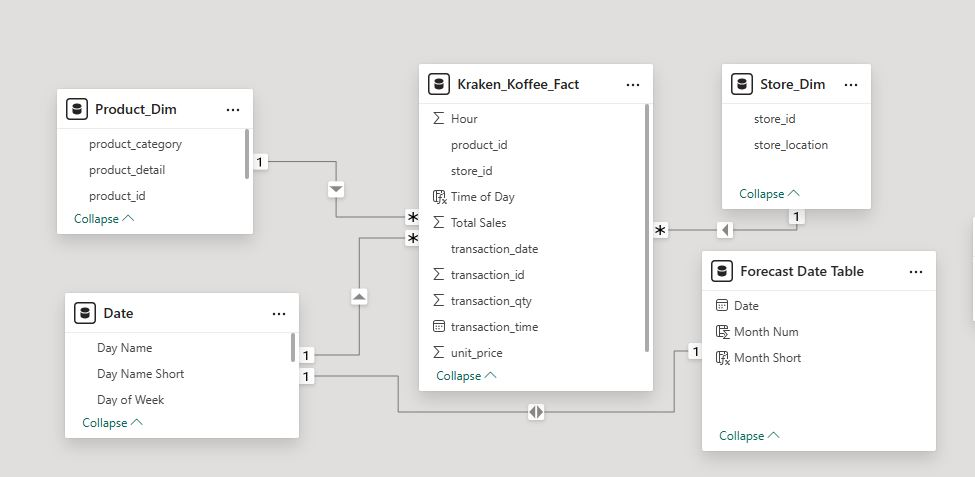
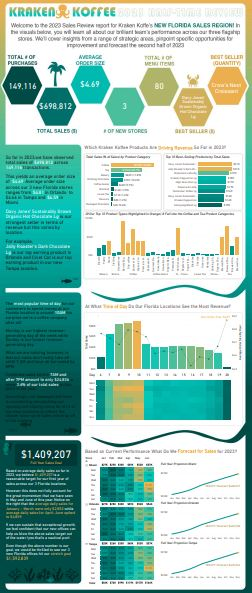
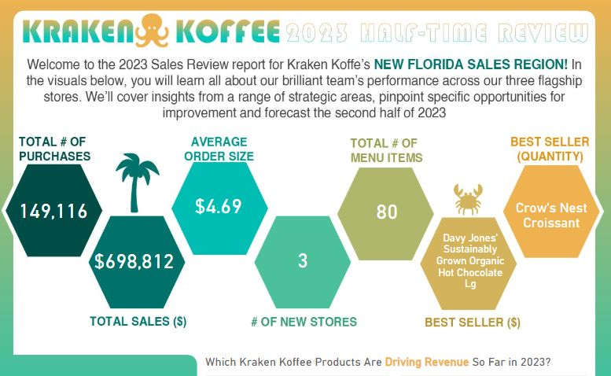
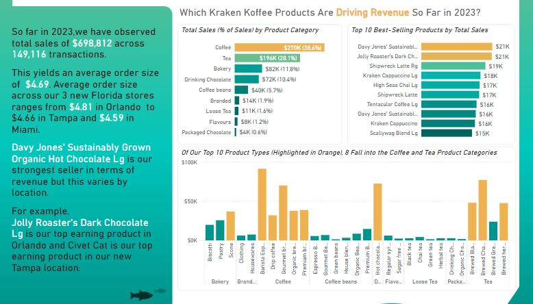
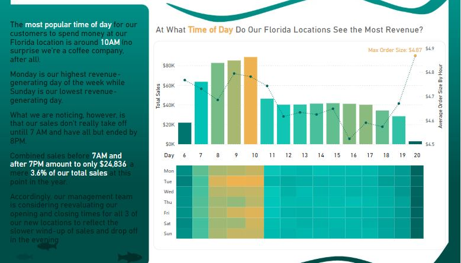
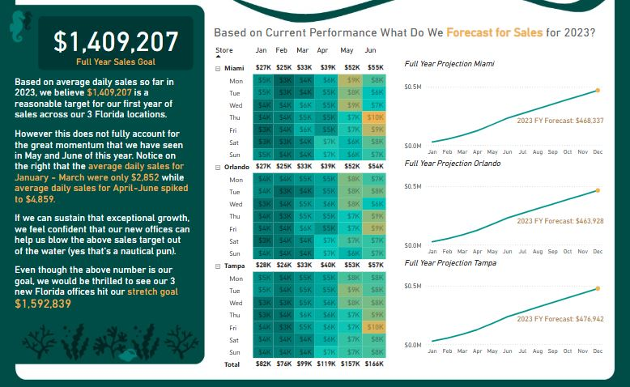

# Kraken Koffee Infographic Project

## Introduction
The Kraken Koffee Infographic Project is a data-driven initiative designed to analyse and visualize sales and transaction data for Kraken Koffee stores. This report details the step-by-step process followed, highlighting key transformations, data modelling, and visual storytelling techniques to derive meaningful insights. The goal is to present actionable recommendations based on the analysis.

---

## Skills and Concepts Demonstrated
- Data transformation and cleaning in Power Query
- Data modelling using a one-to-many relationship structure
- DAX calculations for key metrics and rankings
- Forecasting techniques using DAX functions
- Visualization techniques in Power BI
- Storytelling with data through interactive dashboards

---

## Problem Statement
Kraken Koffee aims to better understand its sales trends, top-performing products, customer behaviours, and store performance. Additionally, they seek a rough forecast of future sales based on historical data to guide decision-making.

---
## Modelling

The data model was designed using a star schema approach:
- **Fact Table:** Contains transactional data with sales, product, and store information.
- **Dimension Tables:**
    - Store Dimension (created by isolating store information and removing duplicates)
    - Product Dimension (created by isolating product details and removing unnecessary columns)
    - Date Dimension (generated from transaction date and enriched with month, day of the week, and short names)

Relationships were predominantly one-to-many, ensuring an efficient structure for querying and analysis.

---
## DAX Measures Created
- **Total Transactions** - Count of Transaction ID
- **Total Sales** - SUM of Total Sales
- **Average Order Size** - AVERAGE of Total Sales
- **Total Stores** - Count of Store
- **Product Sales Rank** - Using **RANKX** with **ALLSELECTED** to rank products by sales
- **Product Transaction Rank** - Similar ranking for transactions
- **Top Earner** - Using **CALCULATE** and **FILTER** to identify the top-earning product
- **Most Popular Seller** - Measure to calculate the most frequently purchased product
- **Custom Label** - Using **FORMAT** to create a custom text label for charts
- **Percentage of Sales** - Using **DIVIDE** and **CALCULATE** to calculate sales as a percentage of total sales
- **Max Average Order Size (Hour)** - Using **MAXX** and **ALLSELECTED** to find the peak average order size by hour
- **Max AOS Marker** - Created using **SWITCH** to highlight the max average order size
- **Max AOS Marker Label** - Using **FORMAT** to create a label for the max AOS marker
- **Average Daily Sales** - Using **AVERAGEX** to calculate average daily sales in the forecast table
- **Average Daily Sales 2** - Using **CALCULATE** and **ALLSELECTED** as a variation of daily sales
- **Average Daily Sales Switch** - Using **SWITCH** to toggle between different sales scenarios
- **Forecast** - Using **SUMX**, **FILTER**, and **DATE** to calculate running total forecast for the year
- **Forecast Marker** - Using **MAX** to mark forecasted total
- **Forecast Label** - Labeling the forecast marker with formatted text
- **Product Category Rank** - Ranking products while ignoring product categories using **RANKX**
- **Top 10 Product Highlight** - Using **IF** to highlight only the top 10 products

---
## Visualization

The infographic consists of a **single interactive Power BI page** divided into the following sections:
### 1. Key DAX Measures

Displayed as key performance indicators (KPIs):
- Total Transactions: **149,116**
- Total Sales: **$698,812**
- Average Order Size: **$4.69**
- Total Stores: **3**
- Top Earners: **Davy Jones' Sustainably Grown Organic Hot Chocolate Lg**
- Most Popular Seller: **Crow's Nest Croissant**

### 2. Which Kraken Koffee Products Are Driving Revenue So Far in 2023?

- **Total Sales (% of Sales) by Product Category:**
    - Coffee: $270K (38.6%)
    - Tea: $196K (28.1%)
    - Bakery: $82K (11.8%)
    - Drinking Chocolate: $72K (10.4%)
    - Coffee Beans: $40K (5.7%)
    - Branded: $14K (1.9%)
    - Loose Tea: $11K (1.6%)
    - Flavours: $8K (1.2%)
    - Packaged Chocolate: $4K (0.6%)

- **Top 10 Best-Selling Products by Total Sales:**
    - Davy Jones' Sustainably Grown Organic Hot Chocolate Lg ($21K)
    - Jolly Roaster's Dark Chocolate Lg ($21K)
    - Shipwreck Latte Rg ($19K)
    - Kraken Cappuccino Lg ($18K)
    - High Seas Chai Lg ($17K)
    - Shipwreck Latte ($17K)
    - Tentacular Coffee Lg ($16K)
    - Davy Jones' Sustainably Grown Organic Hot Chocolate ($16K)
    - Kraken Cappuccino ($16K)
    - Scallywag Blend Lg ($15K)

- **Category Highlight:**
    - Of the top 10 product types, 8 belong to the Coffee and Tea categories.

### 3. At What Time of Day Do Our Florida Locations See the Most Revenue?

- **Hourly Revenue Trend:**
    - Peak revenue occurs around **10 AM**.
    - Combined sales before 7 AM and after 7 PM amount to only $24,836, contributing just **3.6%** of total sales.

- **Day-wise Revenue Trend:**
    - Monday has the highest revenue
    - Sunday has the lowest revenue

### 4. Based on Current Performance, What Do We Forecast for Sales in 2023?

- **Projected Full-Year Sales:** $1,409,207
- **Regional Forecasts:**
    - Miami: $468,337
    - Orlando: $463,928
    - Tampa: $476,942

- **Daily Sales Trends:**
    - January - March: $2,852 average daily sales
    - April - June: $4,859 average daily sales

---

## Analysis
- The strongest-selling product is **Davy Jones' Sustainably Grown Organic Hot Chocolate Lg**.
- The most popular sales period is **10 AM**, reinforcing morning coffee rush behavior.
- Sales are significantly lower before **7 AM** and after **7 PM**, comprising only **3.6%** of total revenue.
- Kraken Koffee's sales are on an upward trend, particularly from April to June.

---

## Conclusion and Recommendations
- **Optimize Store Hours:** Consider adjusting opening and closing hours to reflect peak sales periods.
- **Expand Popular Products:** Focus on top-performing products like organic hot chocolate and dark chocolate blends.
- **Leverage Forecasting Insights:** Maintain momentum by using data-driven sales projections to strategize promotions.
- **Enhance Customer Engagement:** Identify location-specific product preferences to tailor offerings.
- **Continuous Performance Monitoring:** Keep real-time dashboards updated to guide strategic decisions.
